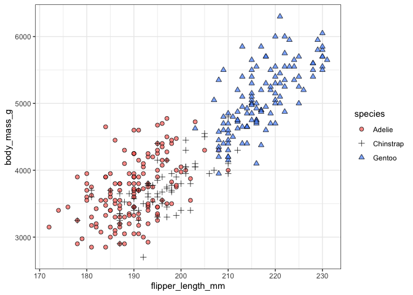

Workshop Companion
================
Stepfanie M Aguillon
4/11/2022

## Introduction

The workshop is primarily focused on the **design principles** for
making figures and not really about **the code** that’s necessary to
create the figures themselves. But, of course, that is often the basis
of what we do\! Creating new code and remixing old code is how we get to
the published figures\! So even though the workshop itself is not about
coding, I’ve compiled this companion document to demonstrate how to do
some of the things we’ve discussed in R.

## Load packages

To start, load all of the required packages.

``` r
library(tidyverse)
library(palmerpenguins)
data(package="palmerpenguins")
```

`ggplot2` is a package within the `tidyverse` that is used to make
figures, but all of the packages are really useful so we’ll load the
entire `tidyverse`.

`palmerpenguins` contains an example dataset that we’ll be working with.
(This is to avoid the commonly used `iris` dataset, which was published
in the Annals of Eugenics\!) More details on the `palmerpenguins`
package can be found here
<https://allisonhorst.github.io/palmerpenguins/>

## About the dataset

The `penguins` dataset contains data for 344 penguins from 3 different
species collected on 3 islands. There are 8 different variables for each
individual row. Let’s look at the first few
rows:

``` r
# throughout this document, the only purpose of the function `kable` is to provide nice visuals of the tables
kable(head(penguins))
```

| species | island    | bill\_length\_mm | bill\_depth\_mm | flipper\_length\_mm | body\_mass\_g | sex    | year |
| :------ | :-------- | ---------------: | --------------: | ------------------: | ------------: | :----- | ---: |
| Adelie  | Torgersen |             39.1 |            18.7 |                 181 |          3750 | male   | 2007 |
| Adelie  | Torgersen |             39.5 |            17.4 |                 186 |          3800 | female | 2007 |
| Adelie  | Torgersen |             40.3 |            18.0 |                 195 |          3250 | female | 2007 |
| Adelie  | Torgersen |               NA |              NA |                  NA |            NA | NA     | 2007 |
| Adelie  | Torgersen |             36.7 |            19.3 |                 193 |          3450 | female | 2007 |
| Adelie  | Torgersen |             39.3 |            20.6 |                 190 |          3650 | male   | 2007 |

Penguin species included in the dataset = Adelie, Chinstrap, Gentoo

Islands included in the dataset = Biscoe, Dream, Torgersen

## Clarity

### Symbol styles

Here are some examples for good point shapes to use in your figures. For
one category data, the best option is to use an open circle. I often use
`shape=21` in combination with a fill color and modifications of
`alpha`:

``` r
ggplot(data=penguins, aes(x=flipper_length_mm, y=body_mass_g)) + 
  geom_point(aes(fill=species), shape=21, alpha=0.5) +
  theme_bw()
```

<!-- -->

If you need multiple shapes, be sure to choose options with strong
visual boundaries. For example, if you start with `21` (an open circle),
you could then use `3` (a cross) and `24` (an open triangle) to create
strong boundaries. You use the `scale_shape_manul()` option in `ggplot2`
to select multiple shapes:

``` r
ggplot(data=penguins, aes(x=flipper_length_mm, y=body_mass_g)) + 
  geom_point(aes(shape=species, fill=species), alpha=0.5) +
  scale_shape_manual(values=c(21,3,24)) +
  theme_bw()
```

<!-- -->

A full list of point shapes are available here
<http://www.sthda.com/english/wiki/r-plot-pch-symbols-the-different-point-shapes-available-in-r>.

### Picking the right type of figure

Picking different types of figures in `ggplot2` is really easy\! Figure
type is determined by the `geom` that you include in your code, and
`geoms` are “stackable.” In the previous examples we used `geom_point`
to create scatterplots with points. This is generally a really good
starting place\!

Some other good options that are very **accurate** and **efficient** and
frequently used are `geom_line` and `geom_boxplot` or `geom_violin`.
Here’s an example using `geom_boxplot`:

``` r
ggplot(data=penguins, aes(x=species, y=body_mass_g)) + 
  geom_boxplot(aes(fill=species)) +
  theme_bw()
```

<!-- -->
