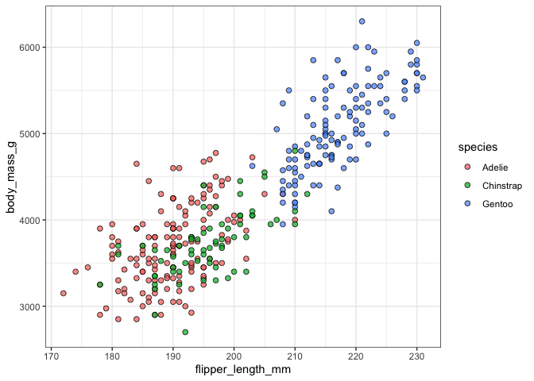

Workshop Companion
================
Stepfanie M Aguillon
4/11/2022

## Introduction

The workshop is primarily focused on the **design principles** for
making figures and not really about **the code** that’s necessary to
create the figures themselves. But, of course, that is often the basis
of what we do\! Creating new code and remixing old code is how we get to
the published figures\! So even though the workshop itself is not about
coding, I’ve compiled this companion document to demonstrate how to do
some of the things we’ve discussed in R.

Note that this companion is unfortunately **not** an exhaustive how-to
for using `ggplot2`. But fortunately there are many of those guides out
there already\!

## Load packages

To start, load all of the required packages.

``` r
library(tidyverse)
library(palmerpenguins)
data(package="palmerpenguins")
```

`ggplot2` is a package within the `tidyverse` that is used to make
figures, but all of the packages are really useful so we’ll load the
entire `tidyverse`.

`palmerpenguins` contains an example dataset that we’ll be working with.
(This is to avoid the commonly used `iris` dataset, which was published
in the Annals of Eugenics\!) More details on the `palmerpenguins`
package can be found here
<https://allisonhorst.github.io/palmerpenguins/>

## About the dataset

The `penguins` dataset contains data for 344 penguins from 3 different
species collected on 3 islands. There are 8 different variables for each
individual row. Let’s look at the first few
rows:

``` r
# throughout this document, the only purpose of the function `kable` is to provide nice visuals of the tables
kable(head(penguins))
```

| species | island    | bill\_length\_mm | bill\_depth\_mm | flipper\_length\_mm | body\_mass\_g | sex    | year |
| :------ | :-------- | ---------------: | --------------: | ------------------: | ------------: | :----- | ---: |
| Adelie  | Torgersen |             39.1 |            18.7 |                 181 |          3750 | male   | 2007 |
| Adelie  | Torgersen |             39.5 |            17.4 |                 186 |          3800 | female | 2007 |
| Adelie  | Torgersen |             40.3 |            18.0 |                 195 |          3250 | female | 2007 |
| Adelie  | Torgersen |               NA |              NA |                  NA |            NA | NA     | 2007 |
| Adelie  | Torgersen |             36.7 |            19.3 |                 193 |          3450 | female | 2007 |
| Adelie  | Torgersen |             39.3 |            20.6 |                 190 |          3650 | male   | 2007 |

Penguin species included in the dataset = Adelie, Chinstrap, Gentoo

Islands included in the dataset = Biscoe, Dream, Torgersen

## Clarity

### Symbol styles

Here are some examples for good point shapes to use in your figures. For
one category data, the best option is to use an open circle. I often use
`shape=21` in combination with a fill color and modifications of
`alpha`:

``` r
ggplot(data=penguins, aes(x=flipper_length_mm, y=body_mass_g)) + 
  geom_point(aes(fill=species), shape=21, alpha=0.75, size=2) +
  theme_bw()
```

<!-- -->

If you need multiple shapes, be sure to choose options with strong
visual boundaries. For example, if you start with `21` (an open circle),
you could then use `3` (a cross) and `24` (an open triangle) to create
strong boundaries. You use the `scale_shape_manual()` option in
`ggplot2` to select multiple shapes:

``` r
ggplot(data=penguins, aes(x=flipper_length_mm, y=body_mass_g)) + 
  geom_point(aes(shape=species, fill=species), alpha=0.75, size=2) +
  scale_shape_manual(values=c(21,3,24)) +
  theme_bw()
```

<!-- -->

A full list of point shapes are available here
<http://www.sthda.com/english/wiki/r-plot-pch-symbols-the-different-point-shapes-available-in-r>.

### Picking the right type of figure

Picking different types of figures in `ggplot2` is really easy\! Figure
type is determined by the `geom` that you include in your code, and
`geoms` are “stackable.” In the previous examples we used `geom_point`
to create scatterplots with points. This is generally a really good
starting place\!

Some other good options that are very **accurate** and **efficient** and
frequently used are `geom_line` and `geom_boxplot`/`geom_violin`. Here’s
an example using `geom_boxplot`:

``` r
ggplot(data=penguins, aes(x=species, y=body_mass_g)) + 
  geom_boxplot(aes(fill=species)) +
  theme_bw()
```

<!-- -->

## Color

### Color palettes

You can easily use color palettes **directly** in `ggplot2` using
`scale_color_brewer()` or `scale_fill_brewer()` (depending on how the
color option is called). Here are two examples:

``` r
ggplot(data=penguins, aes(x=flipper_length_mm, y=body_mass_g)) + 
  geom_point(aes(fill=species), shape=21, alpha=0.75, size=2) +
  scale_fill_brewer(palette="Set1") + 
  theme_bw()
```

<!-- -->

``` r
ggplot(data=penguins, aes(x=flipper_length_mm, y=body_mass_g)) + 
  geom_point(aes(fill=species), shape=21, alpha=0.75, size=2) +
  scale_fill_brewer(palette="Spectral") + 
  theme_bw()
```

<!-- -->

`RColorBrewer` has a lot of color palettes available\! Below they are
separated into the three groups discussed in the workshop: sequential
palettes, categorical palettes, and diverging palettes.

``` r
#install.packages("RColorBrewer")
library("RColorBrewer")
display.brewer.all(colorblindFriendly=FALSE)
```

<!-- -->

### Color blind friendly palettes

`RColorBrewer` itself has many color palettes that are colorblind
friendly:

``` r
display.brewer.all(colorblindFriendly=TRUE)
```

<!-- -->

In the workshop I also mentioned other options. One categorical palette
option from *Wang et al. 2011* is as
follows:

``` r
cbfriendly <- c("#000000", "#E69F00", "#56B4E9", "#009E73", "#F0E442", "#0072B2", "#D55E00", "#CC79A7")
```

Many of Paul Tol’s color schemes are also colorblind friendly:
<https://cran.r-project.org/web/packages/khroma/vignettes/tol.html#introduction>

If you make your own palette or use one you find online, it is very easy
to use in `ggplot2` with `scale_color_manual()` or `scale_fill_manual()`
(again, depending on how the color option is called):

``` r
cbfriendly1 <- c("#56B4E9", "#E69F00", "#D55E00")

ggplot(data=penguins, aes(x=flipper_length_mm, y=body_mass_g)) + 
  geom_point(aes(fill=species), shape=21, alpha=0.75, size=2) +
  scale_fill_manual(values=cbfriendly1) + 
  theme_bw()
```

<!-- -->

## Emphasis

There are many ways to add emphasis in a figure. Some of the easiest
ways in `ggplot2` to emphasize are using color, point size, or point
shape. Since you’ve already seen how to modify color and point shape,
here I will include a brief example on how to change point size for
emphasis.

Depending on how (and what) you would like to emphasis, you will likely
need to work with your dataset to create a new variable. This is easily
accomplished with the `mutate()` function in `dplyr` (a `tidyverse`
package). In this case, I will create a new variable to highlight the
Gentoo penguin species.

``` r
penguin_emphasis <- penguins %>%
  mutate(emphasize = ifelse(species=="Gentoo","YES","NO"))
```

We now have a new variable at the end of the dataset (`emphasize`) that
we can use to tell `ggplot2` to emphasize Gentoo penguins in the
figure:

``` r
kable(head(penguin_emphasis))
```

| species | island    | bill\_length\_mm | bill\_depth\_mm | flipper\_length\_mm | body\_mass\_g | sex    | year | emphasize |
| :------ | :-------- | ---------------: | --------------: | ------------------: | ------------: | :----- | ---: | :-------- |
| Adelie  | Torgersen |             39.1 |            18.7 |                 181 |          3750 | male   | 2007 | NO        |
| Adelie  | Torgersen |             39.5 |            17.4 |                 186 |          3800 | female | 2007 | NO        |
| Adelie  | Torgersen |             40.3 |            18.0 |                 195 |          3250 | female | 2007 | NO        |
| Adelie  | Torgersen |               NA |              NA |                  NA |            NA | NA     | 2007 | NO        |
| Adelie  | Torgersen |             36.7 |            19.3 |                 193 |          3450 | female | 2007 | NO        |
| Adelie  | Torgersen |             39.3 |            20.6 |                 190 |          3650 | male   | 2007 | NO        |

We tell `ggplot2` to change the size of the points by modifying the
`aes()` option within `geom_point`. By placing `size=emphasize` *within*
the `aes()`, we are telling `ggplot2` that it will use the data (the
`emphasize` variable) to determine the size of the points in the figure.
(Previously we had include `size=2` outside the `aes()` telling
`ggplot2` that we wanted all of the points to be of size
2.)

``` r
ggplot(data=penguin_emphasis, aes(x=flipper_length_mm, y=body_mass_g)) + 
  geom_point(aes(fill=species, size=emphasize), shape=21, alpha=0.75) +
  scale_fill_manual(values=cbfriendly1) + 
  theme_bw()
```

<!-- -->

You can use a similar process of first mutating the dataset to include a
new “emphasis” variable (in `dplyr`) and then changing the color or the
shape or any number of other options in the figure (in `ggplot2`)\! If
things don’t seem to be working correctly, remember to first check if
you’ve modified options *within* `aes()` or not\!

For some other basic tips on using `dplyr` see my GitHub repository
<https://github.com/stepfanie-aguillon/AOS2021-dplyr>\!

## Everything stacks\!

Finally, don’t forget that you can stack all of these different options
together\! The different design principles stack, elements in `ggplot2`
stack, etc. etc. By combining multiple elements together, you can ensure
that your figure will convey your point as clearly, accurately, and
efficiently as possible\!

And there are SO many options in `ggplot2` to
explore\!

``` r
ggplot(data=penguin_emphasis, aes(x=flipper_length_mm, y=body_mass_g)) + 
  geom_point(aes(fill=species, shape=species, size=emphasize), alpha=0.75) +
  geom_smooth(aes(color=species), method="lm", se=FALSE) +
  scale_fill_manual(values=cbfriendly1) + 
  scale_color_manual(values=cbfriendly1) +
  scale_shape_manual(values=c(21,21,24)) +
  scale_size_manual(values=c(2,4)) +
  xlab("Flipper length (mm)") + 
  ylab("Body mass (g)") +
  labs(shape="Species name", fill="Species name") +
  theme(axis.title=element_text(face="bold",size=12), axis.text=element_text(size=10,color="black")) +
  guides(size=FALSE,color=FALSE) +
  theme_bw()
```

<!-- -->
